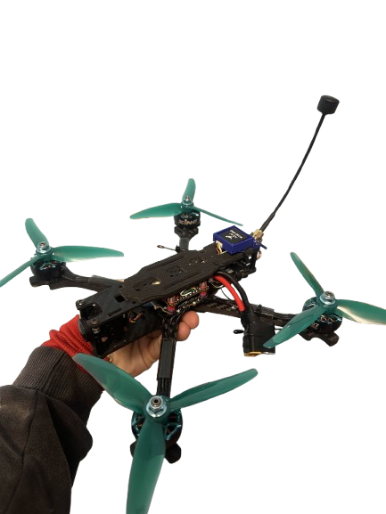

<h1 align="center">👋 Hi, I'm Revei Tudor Stefan</h1>
<h3 align="center">🚁 Electronics and Drones Enthusiast</h3>

  
  

---

<table>
<tr>
<td width="60%" valign="top">

### 🧠 About Me
- 🔌 Passionate about **Electronics, Embedded Systems & Drones**
- 🧠 Strong interest in **microcontrollers & low-level programming**
- 🚀 Always learning and experimenting with new technologies
- 🚁 Curious about **flight control, sensors & aerial systems**

### 🌍 Languages
- 🇷🇴 Romanian — **Expert**
- 🇬🇧 English — **Expert**
- 🇩🇪 German — **Beginner**

### 🛠️ Core Skills
- 🐍 **Python / MicroPython**
- 🔧 **Altium Designer (PCB Design)**
- 🤖 **Microcontrollers (ESP32, STM32, Arduino)**
- ⚡ **Embedded Systems & Hardware Debugging**

### 💻 Programming & Tools

  <!-- Programming languages -->
  
  
  

  <!-- Tools -->
  
  
  

</td>

<td width="40%" align="center">

  

<i>Embedded systems & aerial technology 🚁</i>

</td>

## 📌 My Projects

  <table align="center" width="100%">
    <tr>
      <td align="center" width="50%">
        
         
        <b>Intelligent FPV Drone</b> 
        Object detection & tracking
      </td>

      <td align="center" width="50%">
        
         
        <b>Danger Alert System</b> 
        Embedded safety solution
      </td>
    </tr>

    <tr>
      <td align="center" width="50%">
        
         
        <b>Raspberry Pi IoT Router</b> 
        Ethernet expansion board
      </td>

      <td align="center" width="50%">
        
         
        <b>Guitar DSP Board</b> 
        Audio signal processing
      </td>
    </tr>
  </table>

